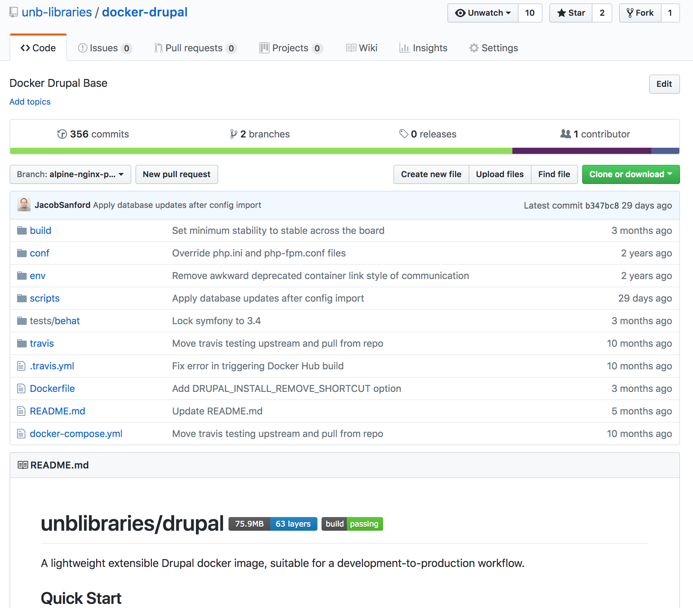

# Base Image : docker-drupal
We have developed a [base image](https://github.com/unb-libraries/docker-drupal) that all other Drupal instances are extended from.



## Why not the community Drupal Image?
Originally, the [official Drupal Docker image](https://hub.docker.com/_/drupal/) wasn't ideal. It was bundled with apache only, was quite large in size, and contained a large amount of packages that didn't fit in with our lean container philosophy. Things have changed quite a bit in the last 3 years, however, and the community image is a great option.

So why don't we use it? The answer isn't simple, but at this point in time we stick with our own homegrown base image for consistency - we leverage layering of increasingly complex base images for all of our applications:

 * [nginx-only](https://github.com/unb-libraries/docker-nginx)
 * [nginx-phpfpm](https://github.com/unb-libraries/docker-nginx-php)
 * [Drupal](https://github.com/unb-libraries/docker-drupal)

This ensures that in all applications (not only Drupal), that we have access to:

 * app at /app/html
 * a consistent pre-init.d script system in /scripts/
 * 15 min cron
 * drush

## Build Process
Why read about this? Watch it happen yourself!

```
git clone -b alpine-nginx-php7-8.x-composer git@github.com:unb-libraries/docker-drupal.git docker-drupal
cd docker-drupal
docker-compose up -d; docker-compose logs
```

## Startup Process
Base image container startup leverages a pre-init.d script system in /scripts/.

| Step                          | Description                                |
|-------------------------------|--------------------------------------------|
| [50_report_environment.sh](https://github.com/unb-libraries/docker-drupal/blob/alpine-nginx-php7-8.x-composer/scripts/pre-init.d/50_report_environment.sh) | Report to stdout the environment the application is starting in. Useful for logging monitoring. |
| [55_wait_for_mysql_server.sh](https://github.com/unb-libraries/docker-drupal/blob/alpine-nginx-php7-8.x-composer/scripts/pre-init.d/55_wait_for_mysql_server.sh)  |  Wait for the MySQL server to become reachable. This is important in local development where the database container may be coming up at the same time as the instance, however, it is also helpful for production environments where the server isn't available - the script will wait until it is.  |
| [57_triage_build.sh](https://github.com/unb-libraries/docker-drupal/blob/alpine-nginx-php7-8.x-composer/scripts/pre-init.d/57_triage_build.sh) |  At this point, a starting container could be in several states: 1. A fresh installation, 2. Previously installed, but database empty, 3. Previously installed, but filesystem blank,  4. Previously installed, filesystem and DB present. If the container is in state #2 or #3, the container will not proceed with any changes. Otherwise, the identified state is then written as metadata to the container for later reference.         |
| [58_transfer_tree_from_tmp.sh](https://github.com/unb-libraries/docker-drupal/blob/alpine-nginx-php7-8.x-composer/scripts/pre-init.d/58_transfer_tree_from_tmp.sh) |  Rsync the newly built tree onto the application root. This exists mainly for legacy reasons, when we set the entire Drupal tree as a volume. This could be removed some day by building the tree in the application root directly. |
| [59_create_config_sync_dir.sh](https://github.com/unb-libraries/docker-drupal/blob/alpine-nginx-php7-8.x-composer/scripts/pre-init.d/59_create_config_sync_dir.sh) | If the local config sync directory does not exist, create it. |
| [60_install_drupal.sh](https://github.com/unb-libraries/docker-drupal/blob/alpine-nginx-php7-8.x-composer/scripts/pre-init.d/60_install_drupal.sh) | Run a drush site-install if the site has not been installed previously. This only applies if state #1 has been detected in the triage_build step above.        |
| [65_remove_install.sh](https://github.com/unb-libraries/docker-drupal/blob/alpine-nginx-php7-8.x-composer/scripts/pre-init.d/65_remove_install.sh) |  Remove the install.php file from the instance.         |
| [70_set_permissions.sh](https://github.com/unb-libraries/docker-drupal/blob/alpine-nginx-php7-8.x-composer/scripts/pre-init.d/70_set_permissions.sh) |  Enforce permissions on files in the webtree. Prevent web daemon from modifying drupal tree files. Prevent web daemon from changing files .htaccess. Make sure local development has needed file permissions.     |
| [73_clear_cache.sh](https://github.com/unb-libraries/docker-drupal/blob/alpine-nginx-php7-8.x-composer/scripts/pre-init.d/73_clear_cache.sh) | Clear the Drupal cache before importing config.          |
| [75_revert_features.sh](https://github.com/unb-libraries/docker-drupal/blob/alpine-nginx-php7-8.x-composer/scripts/pre-init.d/75_revert_features.sh) |  Enforce feature reverting if appropriate environment variables are set. This is mainly a legacy feature, as we do not work in feature driven development in D8.    |
| [78_import_configuration.sh](https://github.com/unb-libraries/docker-drupal/blob/alpine-nginx-php7-8.x-composer/scripts/pre-init.d/78_import_configuration.sh) |  Import the configuration located in /config-yml/.         |
| [79_update_database.sh](https://github.com/unb-libraries/docker-drupal/blob/alpine-nginx-php7-8.x-composer/scripts/pre-init.d/79_update_database.sh) |  If the instance was previously installed, update the instance with module hook_install() changes.         |
| [85_update_entities.sh](https://github.com/unb-libraries/docker-drupal/blob/alpine-nginx-php7-8.x-composer/scripts/pre-init.d/85_update_entities.sh) |  If the instance was previously installed, update the instance with entity changes.         |
| [90_environment_settings.sh](https://github.com/unb-libraries/docker-drupal/blob/alpine-nginx-php7-8.x-composer/scripts/pre-init.d/90_environment_settings.sh) | Apply various environment oriented settings. Disable fields_ui, views_ui, development modules, dblog in prod. Enable these in local.      |
| [94_install_testing_tools.sh](https://github.com/unb-libraries/docker-drupal/blob/alpine-nginx-php7-8.x-composer/scripts/pre-init.d/94_install_testing_tools.sh) |  Install testing tools depending on environment.         |
| [99_clear_cache.sh](https://github.com/unb-libraries/docker-drupal/blob/alpine-nginx-php7-8.x-composer/scripts/pre-init.d/99_clear_cache.sh) |  Clear the cache a final time before deployment.         |
| [99_report_as_complete.sh](https://github.com/unb-libraries/docker-drupal/blob/alpine-nginx-php7-8.x-composer/scripts/pre-init.d/99_report_as_complete.sh) |  Report deployment as complete. This is useful as a marker in monitoring.         |
