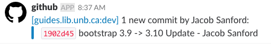
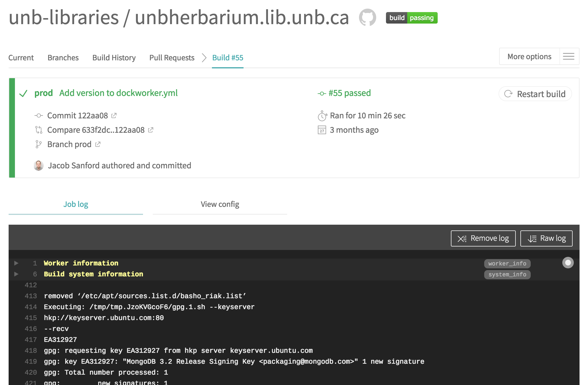
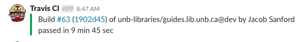

# Travis Built Instances : What Happens When You Push a Commit?

## 1. Developer
### a) Commit is Pushed to GitHub
A team member develops a fantastic feature and pushes a commit to the Lean Instance Repository to GitHub.

## 2. GitHub
### a) Github Slack-Notifies Team of The Commit (via Service Integration)
Github notifies the team of the new commit via Slack.



### b) Github Notifies Travis of the Commit (via Service Integration)
Github invokes its service integrations, and either travis-ci.org (Public GitHub Repository) or travis-ci.com (Private GitHub Repository) is notified of the new commit.

## 3. Travis
### a) Travis Triages the Commit
Travis, upon being notified of the commit reads the ```.travis.yml``` file in the lean repository, which defines how to build and test the instance.

https://github.com/unb-libraries/motty.lib.unb.ca/blob/dev/.travis.yml

Although ```.travis.yml``` references many steps, the actual scripts referenced in this file are not stored in each instance. They are tracked and delivered from Cargodock, in the travis directory:

https://github.com/unb-libraries/CargoDock/tree/master/travis

**Be aware the Travis does NOT notify slack that the build starts**. This is a limitation of travis, and I have logged a feature request here:

https://github.com/travis-ci/travis-ci/issues/8694

### b) Travis Builds the Image
Travis builds the lean repository into a Docker image. The build is fully logged:


(https://travis-ci.org/unb-libraries/unbherbarium.lib.unb.ca/builds/302439089)

### c) Travis Tests the Image
Once the repository is built into an image, the image is launched as a container, and tests are performed. Several elements of the build are tested:

  * Does the repository actually build?
  * Once built, does the launched container error when starting up/importing configuration?
  * If no errors appear at launch, do the features described by the Behat tests respond as intended?

If any of these tests fail, travis Errors and notifies the team via Slack of the failure.

### d) Travis Pushes Built Image to AWS ECR
If the build is successful, however, the image created is pushed to the (AWS Elastic Container Repository)[https://aws.amazon.com/ecr/] repository for the instance.

### e) Travis Cleans Up Old images in the Instance's AWS ECR Repository
To conserve resources (read: Money), old builds are removed from ECR. The maximum number of images to keep in the ECR per branch is define by the OLD_IMAGES_TO_KEEP variable in ```.travis.yml```

https://github.com/unb-libraries/emmr.lib.unb.ca/blob/prod/.travis.yml#L24

### f) Travis Notifies Jenkins of Image Push
Once the image has been pushed to the ECR, Travis POSTs a request to Jenkins, triggering a deployment of the newly pushed image.

https://github.com/unb-libraries/CargoDock/blob/master/travis/triggerKubeDeploy.sh

### g) Travis Notifies Slack
As a final step, travis notifies Slack of the build/test success.


## 4. Jenkins
### a) Jenkins Deploys New Image to Kubernetes
EOM

https://github.com/unb-libraries/CargoDock/blob/master/jenkins/updateKubeDeploymentImage.sh

### b) Jenkins Logs Output of Container Startup in Kube, Tests for Errors
Again, after container launch, the logs are checked for errors:

  * Does the container reach 'Running' status?
  * Once 'Running', does the launched container error when starting up/importing configuration?

If errors are detected, the Jenkins build will fail, notifying the team via Slack.
