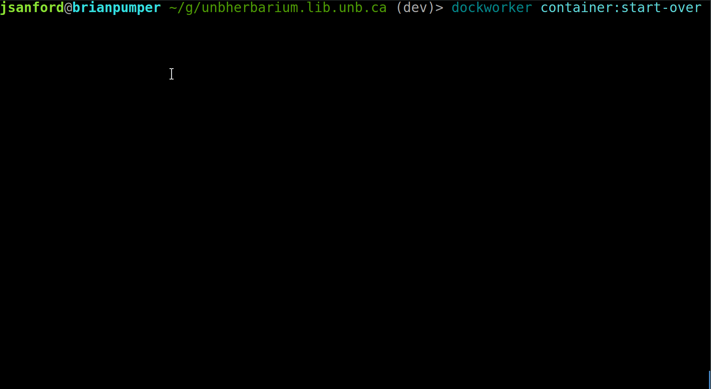

# DockWorker
## Local Instance Development for CargoDock Instances
Dockworker is a framework of (mostly) Robo commands that bridges local development of instances on Linux or OSX.



Try it out with a live instance:

```
> git clone git://github.com/unb-libraries/unbherbarium.lib.unb.ca.git unbherbarium.lib.unb.ca
> cd unbherbarium.lib.unb.ca
> composer install --prefer-dist
> vendor/bin/dockworker instance:start-over
```

To get a list of available dockworker commands:

```
vendor/bin/dockworker
```
