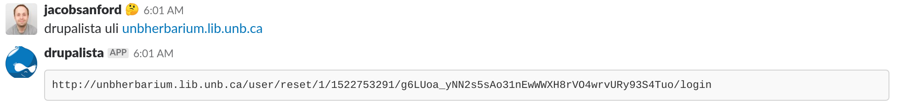

# Drupalista



Drupalista is a slack chatbot that interacts with kubernetes deployed Drupal instances and performs some common tasks:

* ```list_sites``` : List instances controllable by Drupalista.
* ```clear_cache``` : Rebuild the cache of a specific instance
* ```uli``` : Provide a ULI link for the specified instance
* ```hostfile``` : Deliver a hostfile to use for development purposes (if domains are not resolved to k8s cluster)

https://github.com/unb-libraries/drupalista.lib.unb.ca
