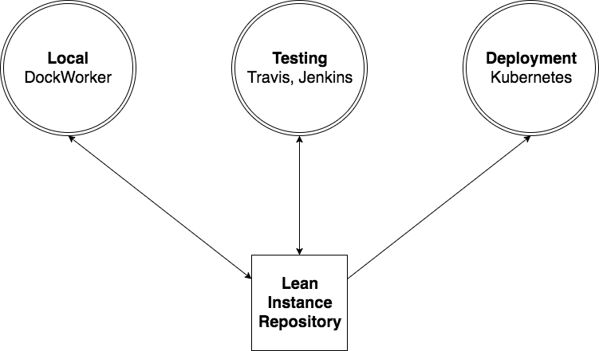

# The Lean Repository



The Lean Instance Repository is the keystone of our workflow. It is a central location that contains all the information needed to build and deploy the instance. A Lean Repository is certainly not a novel idea - many of the major hosts and providers have their own differing formats

 * Pantheon - [Pantheon Git Repository](https://pantheon.io/docs/code/)
 * Platform.sh - [Drupal 8 Format](https://docs.platform.sh/frameworks/drupal8.html)
 * Acquia - [BLT](https://github.com/acquia/blt)

By understanding and borrowing from some of these formats (as well as introducing new features), our lean repository has evolved into the format it is today.

(Example : [unbherbarium.lib.unb.ca](https://github.com/unb-libraries/unbherbarium.lib.unb.ca))

```
.
├── build
│   ├── composer.json
│   ├── profile
│   └── settings
├── config-yml
├── custom
│   ├── modules
│   └── themes
├── env
├── package-conf
├── scripts
├── tests
│   ├── backstop
│   │   ├── dev
│   │   └── prod
│   └── behat
│       ├── behat.yml
│       ├── composer.json
│       └── features
├── composer.json
├── docker-compose.yml
├── docker-compose.yml.travis
├── Dockerfile
├── dockworker.yml
└── README.md
```

## Specifics:
Some specifics
 * ```build/```: Version metadata for all upstream projects and libraries, including Drupal core and contrib modules. Also contains the installation profile for new deployments.
 * ```config-yml/```: The entire configuration to deploy for the Drupal application.
 * ```custom/```: Custom modules, themes and install profiles required by the application.
 * ```env/```: Environment variables for Docker/Jenkins.
 * ```package-conf/```: Configuration for daemons required to deploy the application.
 * ```scripts/```: Scripts used by docker container, generally upon startup.
 * ```tests/```: Tests (Behat, Visual Regression) for the instance.
 * ```composer.json```: Libraries to bootstrap the application locally.
 * ```docker-compose.yml.travis```: Docker-compose file used by travis to deploy instance for testing.
